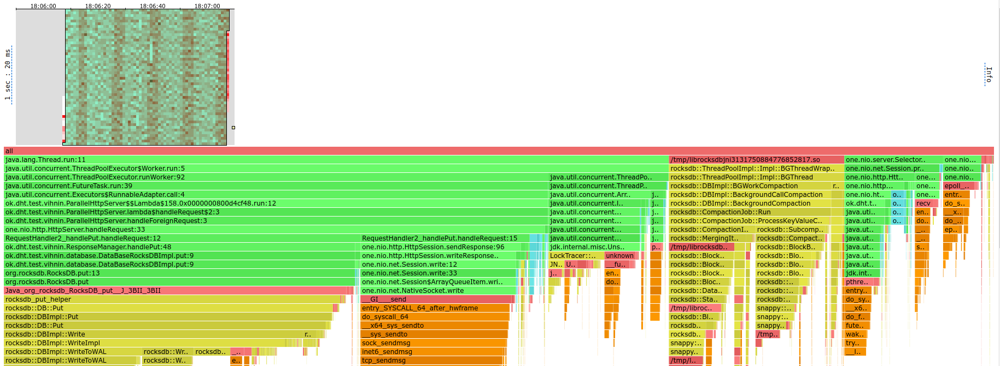

# ОТЧЕТ по 4-ему этапу.


Что было сделано в рамках нынешнего проекта:

Надо было создать поддержку обработки запросов с уточнением числа необходимых репликаций.

Как это реализовывалось:
* Были заменена обработка запроса: после парсинга числа `ack` и `from`, определялось множество
шардов, на которых, будет выполняться обращения в базу (за это стал ответственен `ClusterManager`) и запускался
синхронный фор, который для каждого из `from` делал новый запрос с добавления хедера `Inner: True`, который
означает, что запрос надо сделать у себя локально. Если запрос приходил без этого хедера, то отправлялся в
`internalRequestService` а иначе в `executorService`.
* В случае координатора, то координатор в рамках упомянутого фора делал запрос на все необходимые шарды,
дожидался от них респонса (или обортил, если запрос выходил за таймаут), и собирал число успешных запросов,
сравнил их с числом нужных (`ack`) и отправлял соответсвующий обработке ответ. В случае гета он также судил по
временам пришедших запросов, брал самый свежий ответ и делал вывод по нему.
* Перед фором он делал таймстемп и в запрос прописывал его в качестве хедера, чтобы когда обработчик
ответов `ResponseManager` (вообще он обработчик запросов, но назван так, так как он всегда возвращает респонсы) 
вписывал время в базу вместе с данными. Данные стали хранится в виде `[status][timestamp][data]`, и удаление превратилось
в замену значения на томбстоун, то есть данные вида `[0xFF][timestamp][]`, если данные нормальны, то `status = 0x00`.
* При гете также берется таймстепм из данных и записывается в качестве хедера в репонс.


Так как концептуально мы лишь поменяли то, что ожидаем мы порой не один шард, а несколько, то наша картина не должна была
сильно улучшиться, наоборот, одна должна была ухудшиться, так как запросы, которые ранее были одиночными, множатся, то есть
время на них мы убивает больше. Да мы гарантируем теперь большую целостность данных, но так как мы делаем
фор синхронно, то сильно на этом проигрываем. Хотелось бы это испроавить заменив на параллельную обработку и сбор информации
по симофору или чему-то такому

## Результаты нагрузки

Нагрузка происходила параллельным запуском в двух разных процессах, каждый
из которых работал как отдельная нода, далее происходила нагрузка на первую ноду
и попеременная проверка нагруженности по памяти каждой из нод страндартными утилитами консоли
(обычно получалась равное число).

### PUT

Тест на путе со стандартной нагрузкой в размере 20k:

```
Running 1m test @ http://localhost:19234
  4 threads and 60 connections
  Thread calibration: mean lat.: 1.654ms, rate sampling interval: 10ms
  Thread calibration: mean lat.: 1.682ms, rate sampling interval: 10ms
  Thread calibration: mean lat.: 1.615ms, rate sampling interval: 10ms
  Thread calibration: mean lat.: 1.620ms, rate sampling interval: 10ms
  Thread Stats   Avg      Stdev     Max   +/- Stdev
    Latency    44.06ms   62.42ms 259.33ms   80.36%
    Req/Sec     5.25k     0.93k   10.70k    84.23%
  Latency Distribution (HdrHistogram - Recorded Latency)
 50.000%    4.45ms
 75.000%   79.87ms
 90.000%  156.29ms
 99.000%  207.74ms
 99.900%  232.19ms
 99.990%  253.95ms
 99.999%  258.17ms
100.000%  259.45ms

  Detailed Percentile spectrum:
       Value   Percentile   TotalCount 1/(1-Percentile)

       0.145     0.000000            1         1.00
       0.894     0.100000        99647         1.11
       1.274     0.200000       198917         1.25
       1.660     0.300000       298534         1.43
       2.231     0.400000       397943         1.67
       4.447     0.500000       497347         2.00
       9.031     0.550000       547073         2.22
      17.935     0.600000       596778         2.50
      31.151     0.650000       646567         2.86
      46.815     0.700000       696248         3.33
      79.871     0.750000       745949         4.00
      96.447     0.775000       770889         4.44
     105.215     0.800000       795797         5.00
     117.439     0.825000       820609         5.71
     134.783     0.850000       845535         6.67
     146.175     0.875000       870281         8.00
     151.167     0.887500       882774         8.89
     156.287     0.900000       895124        10.00
     161.535     0.912500       907562        11.43
     166.527     0.925000       920142        13.33
     171.519     0.937500       932584        16.00
     174.207     0.943750       938793        17.78
     177.151     0.950000       945035        20.00
     180.351     0.956250       951227        22.86
     183.295     0.962500       957423        26.67
     186.495     0.968750       963503        32.00
     188.415     0.971875       966669        35.56
     190.847     0.975000       969802        40.00
     193.279     0.978125       972867        45.71
     196.223     0.981250       976011        53.33
     199.679     0.984375       979080        64.00
     201.855     0.985938       980625        71.11
     204.287     0.987500       982214        80.00
     206.463     0.989062       983760        91.43
     208.767     0.990625       985338       106.67
     211.583     0.992188       986836       128.00
     212.991     0.992969       987635       142.22
     214.655     0.993750       988378       160.00
     216.063     0.994531       989139       182.86
     217.855     0.995313       989936       213.33
     219.903     0.996094       990698       256.00
     221.183     0.996484       991117       284.44
     222.207     0.996875       991491       320.00
     223.615     0.997266       991865       365.71
     225.023     0.997656       992263       426.67
     226.687     0.998047       992655       512.00
     227.711     0.998242       992840       568.89
     228.607     0.998437       993031       640.00
     229.759     0.998633       993228       731.43
     230.911     0.998828       993417       853.33
     232.319     0.999023       993615      1024.00
     233.087     0.999121       993714      1137.78
     234.367     0.999219       993808      1280.00
     235.135     0.999316       993901      1462.86
     236.671     0.999414       993996      1706.67
     240.127     0.999512       994093      2048.00
     241.023     0.999561       994142      2275.56
     242.175     0.999609       994192      2560.00
     243.071     0.999658       994238      2925.71
     243.583     0.999707       994305      3413.33
     244.095     0.999756       994338      4096.00
     244.991     0.999780       994368      4551.11
     245.759     0.999805       994386      5120.00
     246.911     0.999829       994410      5851.43
     248.063     0.999854       994433      6826.67
     250.751     0.999878       994456      8192.00
     253.695     0.999890       994470      9102.22
     253.951     0.999902       994482     10240.00
     254.335     0.999915       994493     11702.86
     254.975     0.999927       994507     13653.33
     255.231     0.999939       994520     16384.00
     255.487     0.999945       994526     18204.44
     255.743     0.999951       994532     20480.00
     255.871     0.999957       994537     23405.71
     256.127     0.999963       994543     27306.67
     256.383     0.999969       994547     32768.00
     256.511     0.999973       994550     36408.89
     257.023     0.999976       994554     40960.00
     257.151     0.999979       994556     46811.43
     257.663     0.999982       994560     54613.33
     257.791     0.999985       994564     65536.00
     257.791     0.999986       994564     72817.78
     258.047     0.999988       994566     81920.00
     258.175     0.999989       994567     93622.86
     258.303     0.999991       994568    109226.67
     258.559     0.999992       994573    131072.00
     258.559     0.999993       994573    145635.56
     258.559     0.999994       994573    163840.00
     258.559     0.999995       994573    187245.71
     258.559     0.999995       994573    218453.33
     258.687     0.999996       994574    262144.00
     258.687     0.999997       994574    291271.11
     258.687     0.999997       994574    327680.00
     258.815     0.999997       994575    374491.43
     258.815     0.999998       994575    436906.67
     259.327     0.999998       994576    524288.00
     259.327     0.999998       994576    582542.22
     259.327     0.999998       994576    655360.00
     259.327     0.999999       994576    748982.86
     259.327     0.999999       994576    873813.33
     259.455     0.999999       994577   1048576.00
     259.455     1.000000       994577          inf
#[Mean    =       44.062, StdDeviation   =       62.416]
#[Max     =      259.328, Total count    =       994577]
#[Buckets =           27, SubBuckets     =         2048]
----------------------------------------------------------
  1195383 requests in 1.00m, 76.38MB read
Requests/sec:  19923.09
Transfer/sec:      1.27MB
```

И 30k соответственно:

```
Running 1m test @ http://localhost:19234
  4 threads and 60 connections
  Thread calibration: mean lat.: 420.104ms, rate sampling interval: 1931ms
  Thread calibration: mean lat.: 415.930ms, rate sampling interval: 1914ms
  Thread calibration: mean lat.: 414.681ms, rate sampling interval: 1909ms
  Thread calibration: mean lat.: 416.877ms, rate sampling interval: 1918ms
  Thread Stats   Avg      Stdev     Max   +/- Stdev
    Latency     7.34s     3.66s   14.16s    54.99%
    Req/Sec     5.59k   551.62     6.55k    61.17%
  Latency Distribution (HdrHistogram - Recorded Latency)
 50.000%    7.33s 
 75.000%   10.53s 
 90.000%   12.53s 
 99.000%   13.97s 
 99.900%   14.12s 
 99.990%   14.15s 
 99.999%   14.16s 
100.000%   14.16s 

  Detailed Percentile spectrum:
       Value   Percentile   TotalCount 1/(1-Percentile)

    1351.679     0.000000            1         1.00
    2537.471     0.100000       111834         1.11
    3348.479     0.200000       223036         1.25
    4988.927     0.300000       335049         1.43
    5677.055     0.400000       446276         1.67
    7327.743     0.500000       557523         2.00
    7933.951     0.550000       613752         2.22
    8269.823     0.600000       669116         2.50
    8806.399     0.650000       724804         2.86
    9805.823     0.700000       780795         3.33
   10526.719     0.750000       836369         4.00
   11034.623     0.775000       864330         4.44
   11272.191     0.800000       892228         5.00
   11436.031     0.825000       919911         5.71
   11665.407     0.850000       948279         6.67
   11984.895     0.875000       976146         8.00
   12255.231     0.887500       989792         8.89
   12533.759     0.900000      1003671        10.00
   12771.327     0.912500      1017784        11.43
   13008.895     0.925000      1031525        13.33
   13311.999     0.937500      1045684        16.00
   13402.111     0.943750      1052385        17.78
   13484.031     0.950000      1059864        20.00
   13574.143     0.956250      1066520        22.86
   13647.871     0.962500      1073348        26.67
   13721.599     0.968750      1080834        32.00
   13754.367     0.971875      1084200        35.56
   13787.135     0.975000      1087499        40.00
   13819.903     0.978125      1090936        45.71
   13852.671     0.981250      1094119        53.33
   13893.631     0.984375      1097716        64.00
   13918.207     0.985938      1100003        71.11
   13934.591     0.987500      1101568        80.00
   13950.975     0.989062      1102970        91.43
   13975.551     0.990625      1104647       106.67
   14016.511     0.992188      1106546       128.00
   14032.895     0.992969      1107443       142.22
   14049.279     0.993750      1108600       160.00
   14057.471     0.994531      1109243       182.86
   14065.663     0.995313      1109889       213.33
   14082.047     0.996094      1111213       256.00
   14082.047     0.996484      1111213       284.44
   14090.239     0.996875      1111864       320.00
   14098.431     0.997266      1112511       365.71
   14098.431     0.997656      1112511       426.67
   14106.623     0.998047      1113142       512.00
   14106.623     0.998242      1113142       568.89
   14114.815     0.998437      1113711       640.00
   14114.815     0.998633      1113711       731.43
   14114.815     0.998828      1113711       853.33
   14123.007     0.999023      1114200      1024.00
   14123.007     0.999121      1114200      1137.78
   14123.007     0.999219      1114200      1280.00
   14131.199     0.999316      1114545      1462.86
   14131.199     0.999414      1114545      1706.67
   14131.199     0.999512      1114545      2048.00
   14131.199     0.999561      1114545      2275.56
   14139.391     0.999609      1114801      2560.00
   14139.391     0.999658      1114801      2925.71
   14139.391     0.999707      1114801      3413.33
   14139.391     0.999756      1114801      4096.00
   14139.391     0.999780      1114801      4551.11
   14139.391     0.999805      1114801      5120.00
   14147.583     0.999829      1114938      5851.43
   14147.583     0.999854      1114938      6826.67
   14147.583     0.999878      1114938      8192.00
   14147.583     0.999890      1114938      9102.22
   14147.583     0.999902      1114938     10240.00
   14147.583     0.999915      1114938     11702.86
   14147.583     0.999927      1114938     13653.33
   14155.775     0.999939      1114992     16384.00
   14155.775     0.999945      1114992     18204.44
   14155.775     0.999951      1114992     20480.00
   14155.775     0.999957      1114992     23405.71
   14155.775     0.999963      1114992     27306.67
   14155.775     0.999969      1114992     32768.00
   14155.775     0.999973      1114992     36408.89
   14155.775     0.999976      1114992     40960.00
   14155.775     0.999979      1114992     46811.43
   14155.775     0.999982      1114992     54613.33
   14155.775     0.999985      1114992     65536.00
   14163.967     0.999986      1115008     72817.78
   14163.967     1.000000      1115008          inf
#[Mean    =     7342.464, StdDeviation   =     3656.268]
#[Max     =    14155.776, Total count    =      1115008]
#[Buckets =           27, SubBuckets     =         2048]
----------------------------------------------------------
  1375078 requests in 1.00m, 87.86MB read
Requests/sec:  22918.00
Transfer/sec:      1.46MB
```

Видно, что система уже захлебывается и не вывозит на 30k.

Поглядим на ЦПУ:




По второй ноде кстати отчетливо видно период, через который рок дб занимается архивированием данных,
что забавно.

Видно из флеймграфа, что пут остается тяжелой операцией по большей части из-за работы с базой,
так что добавление сверху 18% на первой ноде не сильно меняет картину, потому на путе также сохранилось в районе 20-25k.


### GET

Аналогичного толка эксперименты до 20к нагрузки, вот результаты:

```
Running 1m test @ http://localhost:19234
  4 threads and 60 connections
  Thread calibration: mean lat.: 73.338ms, rate sampling interval: 703ms
  Thread calibration: mean lat.: 72.807ms, rate sampling interval: 697ms
  Thread calibration: mean lat.: 72.846ms, rate sampling interval: 698ms
  Thread calibration: mean lat.: 72.767ms, rate sampling interval: 697ms
  Thread Stats   Avg      Stdev     Max   +/- Stdev
    Latency     0.94ms  458.24us   7.00ms   66.71%
    Req/Sec     2.50k     2.38     2.51k    78.87%
  Latency Distribution (HdrHistogram - Recorded Latency)
 50.000%    0.92ms
 75.000%    1.25ms
 90.000%    1.52ms
 99.000%    2.13ms
 99.900%    2.97ms
 99.990%    4.77ms
 99.999%    5.98ms
100.000%    7.00ms

  Detailed Percentile spectrum:
       Value   Percentile   TotalCount 1/(1-Percentile)

       0.089     0.000000            1         1.00
       0.365     0.100000        50153         1.11
       0.513     0.200000       100095         1.25
       0.654     0.300000       150062         1.43
       0.787     0.400000       199719         1.67
       0.920     0.500000       249865         2.00
       0.986     0.550000       274942         2.22
       1.052     0.600000       299834         2.50
       1.118     0.650000       324736         2.86
       1.185     0.700000       349794         3.33
       1.255     0.750000       374638         4.00
       1.291     0.775000       387190         4.44
       1.328     0.800000       399620         5.00
       1.366     0.825000       412102         5.71
       1.407     0.850000       424429         6.67
       1.456     0.875000       436930         8.00
       1.485     0.887500       443114         8.89
       1.517     0.900000       449331        10.00
       1.555     0.912500       455648        11.43
       1.598     0.925000       461851        13.33
       1.650     0.937500       468112        16.00
       1.680     0.943750       471233        17.78
       1.713     0.950000       474366        20.00
       1.750     0.956250       477464        22.86
       1.792     0.962500       480571        26.67
       1.843     0.968750       483671        32.00
       1.872     0.971875       485261        35.56
       1.901     0.975000       486771        40.00
       1.936     0.978125       488372        45.71
       1.976     0.981250       489905        53.33
       2.022     0.984375       491455        64.00
       2.049     0.985938       492268        71.11
       2.079     0.987500       493044        80.00
       2.109     0.989062       493807        91.43
       2.147     0.990625       494588       106.67
       2.191     0.992188       495373       128.00
       2.217     0.992969       495753       142.22
       2.249     0.993750       496140       160.00
       2.287     0.994531       496542       182.86
       2.327     0.995313       496912       213.33
       2.381     0.996094       497306       256.00
       2.413     0.996484       497498       284.44
       2.449     0.996875       497695       320.00
       2.495     0.997266       497883       365.71
       2.551     0.997656       498079       426.67
       2.613     0.998047       498278       512.00
       2.649     0.998242       498371       568.89
       2.689     0.998437       498471       640.00
       2.759     0.998633       498568       731.43
       2.857     0.998828       498664       853.33
       2.991     0.999023       498761      1024.00
       3.077     0.999121       498810      1137.78
       3.173     0.999219       498859      1280.00
       3.291     0.999316       498907      1462.86
       3.439     0.999414       498957      1706.67
       3.601     0.999512       499005      2048.00
       3.719     0.999561       499030      2275.56
       3.779     0.999609       499053      2560.00
       3.891     0.999658       499078      2925.71
       4.013     0.999707       499102      3413.33
       4.127     0.999756       499127      4096.00
       4.199     0.999780       499139      4551.11
       4.235     0.999805       499151      5120.00
       4.315     0.999829       499163      5851.43
       4.443     0.999854       499175      6826.67
       4.683     0.999878       499190      8192.00
       4.715     0.999890       499194      9102.22
       4.795     0.999902       499200     10240.00
       4.855     0.999915       499207     11702.86
       4.915     0.999927       499212     13653.33
       4.975     0.999939       499218     16384.00
       5.059     0.999945       499221     18204.44
       5.107     0.999951       499224     20480.00
       5.199     0.999957       499227     23405.71
       5.227     0.999963       499230     27306.67
       5.403     0.999969       499233     32768.00
       5.435     0.999973       499235     36408.89
       5.479     0.999976       499236     40960.00
       5.543     0.999979       499238     46811.43
       5.599     0.999982       499239     54613.33
       5.615     0.999985       499241     65536.00
       5.711     0.999986       499242     72817.78
       5.711     0.999988       499242     81920.00
       5.983     0.999989       499243     93622.86
       5.995     0.999991       499244    109226.67
       6.163     0.999992       499245    131072.00
       6.163     0.999993       499245    145635.56
       6.163     0.999994       499245    163840.00
       6.335     0.999995       499246    187245.71
       6.335     0.999995       499246    218453.33
       6.495     0.999996       499247    262144.00
       6.495     0.999997       499247    291271.11
       6.495     0.999997       499247    327680.00
       6.495     0.999997       499247    374491.43
       6.495     0.999998       499247    436906.67
       6.999     0.999998       499248    524288.00
       6.999     1.000000       499248          inf
#[Mean    =        0.944, StdDeviation   =        0.458]
#[Max     =        6.996, Total count    =       499248]
#[Buckets =           27, SubBuckets     =         2048]
----------------------------------------------------------
  599670 requests in 1.00m, 2.83GB read
Requests/sec:   9994.40
Transfer/sec:     48.28MB
```

``` 
Running 1m test @ http://localhost:19234
  4 threads and 60 connections
  Thread calibration: mean lat.: 3.078ms, rate sampling interval: 10ms
  Thread calibration: mean lat.: 3.322ms, rate sampling interval: 10ms
  Thread calibration: mean lat.: 2.757ms, rate sampling interval: 10ms
  Thread calibration: mean lat.: 2.503ms, rate sampling interval: 10ms
  Thread Stats   Avg      Stdev     Max   +/- Stdev
    Latency   222.07ms  288.35ms   1.06s    82.28%
    Req/Sec     5.29k     1.35k   10.67k    70.97%
  Latency Distribution (HdrHistogram - Recorded Latency)
 50.000%   51.65ms
 75.000%  457.47ms
 90.000%  612.86ms
 99.000%  984.58ms
 99.900%    1.03s 
 99.990%    1.05s 
 99.999%    1.05s 
100.000%    1.06s 

  Detailed Percentile spectrum:
       Value   Percentile   TotalCount 1/(1-Percentile)

       0.106     0.000000            2         1.00
       0.942     0.100000        99809         1.11
       1.466     0.200000       199682         1.25
       2.409     0.300000       299504         1.43
      13.479     0.400000       399244         1.67
      51.647     0.500000       499070         2.00
      81.215     0.550000       548969         2.22
     148.991     0.600000       598923         2.50
     234.495     0.650000       648806         2.86
     361.215     0.700000       698683         3.33
     457.471     0.750000       748731         4.00
     476.415     0.775000       773540         4.44
     494.335     0.800000       798562         5.00
     512.255     0.825000       823564         5.71
     535.039     0.850000       848489         6.67
     564.735     0.875000       873599         8.00
     583.679     0.887500       885846         8.89
     612.863     0.900000       898340        10.00
     692.223     0.912500       910766        11.43
     786.431     0.925000       923276        13.33
     851.967     0.937500       935703        16.00
     887.807     0.943750       942102        17.78
     903.679     0.950000       948346        20.00
     916.479     0.956250       954623        22.86
     927.231     0.962500       960725        26.67
     937.471     0.968750       966933        32.00
     943.103     0.971875       970291        35.56
     948.223     0.975000       973324        40.00
     953.343     0.978125       976431        45.71
     958.975     0.981250       979539        53.33
     965.631     0.984375       982640        64.00
     969.215     0.985938       984112        71.11
     973.823     0.987500       985655        80.00
     979.967     0.989062       987221        91.43
     987.647     0.990625       988753       106.67
     998.399     0.992188       990339       128.00
    1003.519     0.992969       991147       142.22
    1007.615     0.993750       991925       160.00
    1011.199     0.994531       992712       182.86
    1014.271     0.995313       993408       213.33
    1017.343     0.996094       994201       256.00
    1018.879     0.996484       994580       284.44
    1020.927     0.996875       995057       320.00
    1022.463     0.997266       995388       365.71
    1023.999     0.997656       995763       426.67
    1026.047     0.998047       996140       512.00
    1027.583     0.998242       996372       568.89
    1028.607     0.998437       996545       640.00
    1030.143     0.998633       996772       731.43
    1031.167     0.998828       996912       853.33
    1033.215     0.999023       997152      1024.00
    1033.727     0.999121       997215      1137.78
    1034.751     0.999219       997312      1280.00
    1036.287     0.999316       997423      1462.86
    1037.311     0.999414       997502      1706.67
    1039.359     0.999512       997597      2048.00
    1039.871     0.999561       997636      2275.56
    1040.895     0.999609       997710      2560.00
    1041.407     0.999658       997747      2925.71
    1042.431     0.999707       997791      3413.33
    1043.455     0.999756       997835      4096.00
    1043.967     0.999780       997860      4551.11
    1044.991     0.999805       997893      5120.00
    1045.503     0.999829       997910      5851.43
    1046.527     0.999854       997948      6826.67
    1047.039     0.999878       997967      8192.00
    1047.039     0.999890       997967      9102.22
    1047.551     0.999902       997979     10240.00
    1048.063     0.999915       997989     11702.86
    1049.599     0.999927       998033     13653.33
    1049.599     0.999939       998033     16384.00
    1049.599     0.999945       998033     18204.44
    1049.599     0.999951       998033     20480.00
    1049.599     0.999957       998033     23405.71
    1050.623     0.999963       998043     27306.67
    1051.647     0.999969       998051     32768.00
    1051.647     0.999973       998051     36408.89
    1051.647     0.999976       998051     40960.00
    1052.671     0.999979       998057     46811.43
    1052.671     0.999982       998057     54613.33
    1053.695     0.999985       998067     65536.00
    1053.695     0.999986       998067     72817.78
    1053.695     0.999988       998067     81920.00
    1053.695     0.999989       998067     93622.86
    1053.695     0.999991       998067    109226.67
    1053.695     0.999992       998067    131072.00
    1054.719     0.999993       998069    145635.56
    1054.719     0.999994       998069    163840.00
    1054.719     0.999995       998069    187245.71
    1055.743     0.999995       998071    218453.33
    1055.743     0.999996       998071    262144.00
    1055.743     0.999997       998071    291271.11
    1055.743     0.999997       998071    327680.00
    1056.767     0.999997       998074    374491.43
    1056.767     1.000000       998074          inf
#[Mean    =      222.065, StdDeviation   =      288.352]
#[Max     =     1055.744, Total count    =       998074]
#[Buckets =           27, SubBuckets     =         2048]
----------------------------------------------------------
  1198879 requests in 1.00m, 5.66GB read
Requests/sec:  19980.93
Transfer/sec:     96.52MB
```

На гете явно ухудщилось до 20k, так как каждый гет занимаем больше времени и большее участие других нод.

Давайте сравним нагрузки на ЦПУ у ноды 1 "координатора" и ноды 2, которая лишь 
отзывалась на стороние запросы:


Видно, что фокус сместился на работу с сетью и именно что аккамиулирование ответов 
со всех нод, потому и время упало, так как добавилось еще в районе 30% нагрузки как видно из картинки 1.
